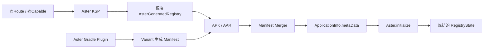

# Aster 设计文档

## 修订记录

| 修订时间（CST）        | 修订人     | 修订说明                         |
|------------------|---------|------------------------------|
| 2026-08-31       | whisper | 调整 Registry Manifest metadata 的 name/value 协议 |
| 2026-07-23 18:33 | whisper | 归并设计目标、候选方案、方案对比、最终选择及未选方案原因 |

本文记录 Aster 的设计目标、候选方案、最终选择和主要取舍。当前行为以源码为准；本文用于解释“为什么这样设计”，不作为接入步骤或源码目录索引。

## 1. 背景与目标

Aster 为模块化 Android 工程提供两项基础能力：

* 通过稳定路径导航到 `Activity`。
* 通过稳定名称或接口类型发现业务能力实现。

系统需要同时满足以下目标：

* 业务调用方只依赖 `api` 模块，不直接依赖实现模块。
* 一个能力接口允许存在多个实现，同时支持按名称精确查找。
* 业务模块进入最终依赖图后自动完成注册，不维护宿主总表。
* Registry 与 Android Variant、AAR 和 Manifest Merger 的标准行为一致。
* 启动阶段不扫描 Dex，不遍历业务类，不依赖 AGP 私有 API。
* 编译期可以确认的问题尽量在编译期失败，运行时不发布半成品状态。

## 2. 非目标

Aster 不计划承担以下职责：

* `Fragment` 路由。
* Deep Link 解析和分发。
* 路由拦截器、降级链、绿色通道和超时回调。
* 字段注入、构造函数注入或完整 DI 容器。
* 自动参数注入。
* 事件总线和进程间能力发现。
* Capability 之间的依赖注入或初始化依赖排序。
* 动态特性模块的安装状态管理。

目标页需要展示不同 `Fragment` 时，对外仍暴露一个 `Activity` 路由，由该 `Activity` 根据 extras 决定内部页面。

## 3. 核心模型

### 3.1 路由模型

路由以完整路径作为全局主键，只指向 `Activity`：

```text
/user/login -> LoginActivity
```

路径至少包含两个段，格式为 `/<segment>/<page>`。每段以小写字母开头，只包含小写字母、数字和下划线。首段必须等于模块声明的 `aster.segment`。

选择 Activity-only 的原因：

* `Activity` 是稳定的跨模块 Android 入口。
* `Fragment` 的容器、导航栈和生命周期属于页面内部实现。
* 路由层不需要绑定 Navigation、FragmentManager 或特定 UI 框架。

### 3.2 能力模型

能力名称是主键，接口类型是查询维度：

```text
user.account.session -> UserSessionCapabilityImpl
```

设计规则：

* 一个能力名只能对应一个实现。
* 一个接口可以有多个不同名称的实现。
* `Aster.resolve(name)` 用于精确查找。
* `Aster.resolve(type)` 返回按能力名排序后的第一个实现。
* `Aster.resolveAll(type)` 返回按能力名排序后的全部实现。

没有使用接口类型作为主键，因为接口天然允许多实现；如果强制单实现，会失去扩展点能力，如果允许覆盖，则结果会依赖加载顺序。

### 3.3 API 与实现边界

推荐依赖方向：

```text
feature-xxx-api
    ^
    |
feature-xxx-impl
    ^
    |
   app
```

`api` 模块声明能力接口、能力名、路由路径和参数常量。`impl` 模块提供能力实现、Activity 和注解。调用方只依赖 `api` 与 `aster-runtime`，不引用实现类型。

## 4. 自动注册方案对比

| 方案 | 优点 | 主要问题 | 结论 |
| --- | --- | --- | --- |
| 宿主手写总注册表 | 实现最简单，调试直观 | 容易漏注册，宿主需要感知所有实现，破坏模块边界 | 不选择 |
| 运行时扫描 Dex | 不需要构建期聚合 | 启动成本高，多 Dex 和混淆边界复杂，难以稳定测试 | 不选择 |
| 每模块 ContentProvider 或 Startup Initializer | Android 自动创建，无需宿主调用每个模块 | 组件数量增加，初始化时机和顺序难控制，多进程行为复杂 | 不选择 |
| assets 注册器索引 | 运行时只做精确反射，不扫 Dex | assets 合并、索引冲突和 Variant 传播需要额外协议 | 不选择 |
| JSON/metadata JAR Variant 聚合 | 可以在宿主构建期生成单一 Registry，并检查跨模块冲突 | 需要自定义可消费 Variant、属性匹配和聚合任务，AGP/KSP/Gradle 耦合较重 | 不选择 |
| marker class + ASM Transform | 最终产物可以直接引用 Registry | 依赖字节码处理和 AGP 构建扩展，兼容成本高 | 不选择 |
| Manifest 模块自注册 | 使用 AAR Manifest 和标准 Variant 选择，模块独立发布，运行时精确加载 | 依赖字符串反射和 R8 规则，跨外部产物冲突延迟到运行时 | 最终选择 |

## 5. 最终方案

最终采用“模块自注册 + Manifest 索引”：



每个 application 或 library Variant 生成：

* `<androidNamespace>.aster.generated.AsterGeneratedRegistry`。
* 指向该类的 Manifest `<meta-data>`。

Registry metadata 使用注册器全限定类名作为 `android:name`，使用 `com.whisper.aster.registry` 作为固定
`android:value`。Manifest Merger 以 `android:name` 标识 metadata 条目，因此类名可以让不同模块独立合并；固定 value
只负责标记该条目属于 Aster，避免在 name 和 value 中重复保存类名。

固定发现标记不携带协议版本。当前 plugin、compiler 和 runtime 要求使用同一发布版本，尚不存在需要 Runtime 同时解析的多套
metadata 格式；如果未来允许不同版本产物独立演进，应单独设计兼容读取和版本协商，而不是提前把版本号写入发现标记。

最终 APK 的 Manifest Merger 自动收集 app 和实际依赖 AAR 的 metadata。Runtime 读取最终 `ApplicationInfo.metaData`，按类名精确反射并安装所有 Registry。

### 5.1 选择该方案的原因

* Android library 的 Manifest 本来就会随 AAR 发布。
* 依赖 Variant、`matchingFallbacks` 和 AAR 选择继续由 Gradle/AGP 负责。
* 插件不需要访问其它 Project，也不拼接其它模块的任务名。
* Runtime 不扫描 Dex，只加载 Manifest 已确认的少量类。
* 模块可以独立编译和发布，不要求宿主生成全局源码。

### 5.2 接受的代价

* Registry 类名存在于 Manifest 字符串中，必须通过 consumer rules 保留。
* 外部 AAR 不参与当前源码 Build 的 segment 唯一性检查，冲突由 Runtime 拦截。
* plugin、compiler、runtime 共同维护 Registry 协议，当前没有协议版本协商。
* Manifest 中类名存在但 class 不存在时，Runtime 只能记录 warning 并忽略。

## 6. 关键设计决策

### 6.1 segment 作为模块命名空间

每个应用 Aster 插件的源码模块声明一个 `aster.segment`。路由路径和能力名必须以该 segment 开头。

这让模块内 KSP 校验与 Build 内 segment 唯一性检查结合后，可以阻止规范注解链路产生跨源码模块的名称冲突，而不需要聚合全部声明。

限制：Configuration on Demand、Isolated Projects 或独立 Included Build 可能不配置所有模块，因此不能把这项检查理解为所有外部产物的全局证明。

### 6.2 Registry 按模块和 Variant 生成

每个模块、每个生产 Variant 都有独立编译输出，但 Registry 使用相同 namespace 派生规则。Variant 选择完全交给 Android 构建系统。

没有采用“宿主聚合 Registry”，因为它需要解析依赖图中的自定义 metadata Variant，并重新实现大量 Variant 兼容逻辑。

### 6.3 普通 class + public 无参构造

`@Capable` 只接受可由 Runtime 统一创建的普通 class：

* 不是 `object`、companion object、interface 或 inner class。
* 不是抽象类。
* 对生成 Registry 可见。
* 提供 JVM public 无参构造。

没有为 Kotlin `object`、工厂方法或构造函数注入增加分支，以保持 KSP 校验、生成代码、Runtime 反射和 R8 规则一致。

### 6.4 单例与非单例

`@Capable(singleton = true)` 按能力名缓存完整初始化后的实例；`false` 表示每次解析都重新构造并初始化。

实例只有在构造和 `initialize(Application)` 均成功后才进入单例缓存。失败实例不会发布。

### 6.5 禁止 Capability 初始化依赖

Capability 构造函数和 `initialize()` 只能初始化自身，不得直接或间接解析其它 Capability，也不得等待会解析 Capability 的异步任务。

Runtime 没有依赖图、循环检测和跨线程死锁检测。加入这些机制会把轻量能力发现升级成依赖注入容器，因此当前选择以公开契约禁止依赖。

### 6.6 错误处理

Aster 按责任边界处理错误：

* 能在 KSP 或 Gradle 阶段确认的问题直接中断构建。
* 生命周期、注册冲突和已注册目标结构损坏抛出异常。
* 动态名称格式错误或目标未找到记录 error 并返回安全值。
* Manifest 固定标记对应的类名无效时记录 warning 并忽略候选项。
* Android、业务实现和 Launcher 抛出的异常不吞掉。
* `Error`、`LinkageError` 和系统级故障不转换为普通失败。

## 7. 已废弃方案

以下名词仅代表历史设计，不属于当前实现：

* `ModuleRegistrar` 和 assets 注册器索引。
* `AsterRouteMetadata.bin`。
* `META-INF/aster/routes/v1/*.json`。
* `asterMetadata<Variant>Elements`。
* 跨模块 marker class 聚合。
* ASM Transform 聚合。
* Runtime Dex 扫描。

如需改变当前 Manifest 自注册方案，应重新评估 Variant、外部 AAR、R8、androidTest 和协议兼容性，而不是恢复其中某一个孤立组件。

## 8. 演进原则

新增功能前应先判断它是否仍属于“能力发现 + Activity 路由”：

* 如果需要对象依赖图、作用域或构造注入，应使用 DI 方案，而不是扩展 CapabilityRegistry。
* 如果需要页面栈、Fragment 或 Deep Link，应在 Aster 之上建设独立导航层。
* 如果需要跨产物编译期冲突检查，应先设计可版本化 metadata 协议和发布策略。
* 修改 Registry 协议时，plugin、compiler、runtime、Manifest 和 R8 规则必须作为一个整体演进。
