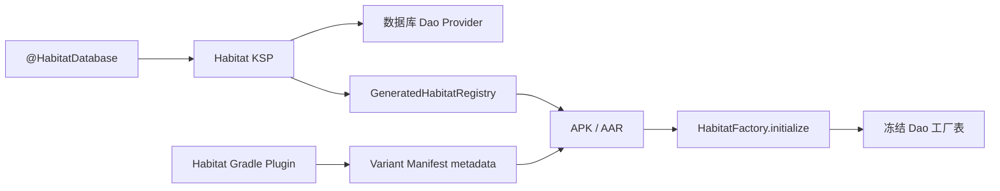

# Habitat 设计文档

## 修订记录

| 修订时间（CST）  | 修订人     | 修订说明                  |
|------------|---------|-----------------------|
| 2026-09-01 | whisper | 允许 Registry 类缺失时降级为空注册表 |
| 2026-09-01 | whisper | 区分合法查找未命中与运行时完整性失败 |
| 2026-09-01 | whisper | 明确 Dao 工厂取消异常传播边界 |
| 2026-09-01 | whisper | 明确静态注册、生成 ABI 和唯一装配边界 |
| 2026-08-31 | whisper | 简化 Dao binding 快照发布实现 |
| 2026-08-31 | whisper | 支持 Dao qualifier 多数据库绑定 |
| 2026-08-31 | whisper | 明确固定 Manifest metadata 协议取舍 |
| 2026-07-28 | whisper | 整理 Habitat 设计目标、模型和取舍 |

本文记录 Habitat 的设计目标、核心模型、最终方案和主要取舍。维护实现请阅读 [开发文档](development.md), 业务接入请阅读 [使用文档](usage.md)。

## 1. 背景与目标

模块化业务通常把 `Entity`、`Dao` 和 Repository 放在业务实现模块, 但 RoomDatabase 需要在最终装配模块显式声明所有 `entities` 和 Dao 抽象方法。`AppDataBase` 放在 app 模块时, 业务模块不能反向依赖 app, 因此不能直接通过数据库类获取 Dao。

Habitat 的目标是提供一个独立于 Aster 的 Dao 发现入口:

* 业务模块按 Dao 类型获取唯一实例, 或按 Dao 类型和语义 qualifier 精确获取实例。
* 数据库最终装配仍由 app 或唯一装配 library 负责。
* Room 的实体、Dao、schema 和迁移检查仍交给 Room 编译器。
* 多 Dao 绑定的缺失或重复 qualifier 在 KSP 阶段失败。
* 运行时不扫描 Dex, 不硬编码 app 包名, 不要求业务手写总注册表。

## 2. 非目标

Habitat 不计划承担以下职责:

* 自动生成 RoomDatabase。
* 自动发现所有业务 Entity 并修改 `@Database.entities`。
* 管理数据库迁移、备份、加密、清理策略或 schema 版本。
* 替代 Repository、UseCase 或依赖注入容器。
* 支持按数据库名获取 Dao。
* 为多个 Dao 绑定推断默认数据库。
* 支持运行时追加 binding、动态 Feature 安装后重载 Registry 或切换数据库归属。
* 把生成用 Registry / Provider ABI 作为业务手写扩展点。

## 3. 核心模型

### 3.1 装配模型

最终装配模块持有 RoomDatabase:

```text
app
  AppDataBase
  @HabitatDatabase
  abstract fun userDao(): UserDao

feature:user-impl
  UserDao
  UserEntity
  UserRepository -> HabitatFactory.get(UserDao::class)
```

`app` 拥有最终依赖图, 可以看到实际打入 APK 的业务 Dao 和 Entity。业务模块只依赖自己的 `api`、`impl` 和 `habitat-runtime`, 不引用 app 数据库类。

同一个 Dao 类型可以由多个数据库提供。qualifier 描述 `account`、`archive` 等业务存储角色, 不要求 feature 知道数据库类名。
只有一个绑定时, 无论 accessor 是否显式声明 qualifier, 都允许按类型获取; 存在多个绑定时必须带 qualifier 精确获取。
Habitat 不定义默认 binding, 因此不会在多个候选中任意选择。

### 3.2 Dao Provider 模型

每个参与 Habitat 的 RoomDatabase 生成一个 Dao Provider。Provider 暴露 Dao 类型、可空 qualifier 和工厂函数的二级映射。
`HabitatDaoProvider` 是 compiler 与 runtime 之间的生成 ABI, 不作为业务手写扩展点:

```kotlin
class AppDataBaseHabitatDaoProvider : HabitatDaoProvider {

    override val daoFactories: Map<KClass<*>, Map<String?, () -> Any>> = mapOf(
        UserDao::class to mapOf(
            "user.account" to { AppDataBase.instance.userDao() },
        ),
    )
}
```

未标记 `@HabitatDaoBinding` 的唯一 accessor 使用 `null` key。显式标记的 accessor 使用注解值作为 key。工厂使用 lambda 延迟
读取数据库实例, `HabitatFactory.initialize()` 只安装函数, 不创建或缓存 Dao 对象, 从而避免初始化时抢先访问数据库单例。

### 3.3 Registry 模型

最终唯一装配模块生成一个固定类名 Registry。Registry 是 compiler、Manifest 索引与 runtime 之间的生成 ABI, 不支持运行时
追加 Provider:

```text
<android.namespace>.habitat.generated.GeneratedHabitatRegistry
```

Provider 生成在 Registry 包名下的子包:

```text
<android.namespace>.habitat.generated.providers.<database.package>
```

Provider 简单类名使用数据库嵌套类名加 `HabitatDaoProvider` 后缀。数据库全限定名进入 Provider 包路径, 避免不同包下同名数据库生成物冲突。

## 4. 自动注册方案

Habitat 采用“单装配入口 + Manifest 索引”:



Gradle 插件根据 Android namespace 计算 Registry 生成包名, 通过 KSP 参数 `habitat.registryPackage` 传给处理器, 并为每个 Variant 生成固定 metadata:

```xml
<meta-data
    android:name="com.whisper.habitat.registry"
    android:value="<android.namespace>.habitat.generated.GeneratedHabitatRegistry" />
```

Runtime 从最终 `ApplicationInfo.metaData` 精确读取该 value 并反射加载 Registry。

metadata 的 name 和 value 不反转。固定 name 是最终 APK 中唯一的 Habitat 槽位, 两个外部 AAR 提供不同 Registry 时会由
Manifest Merger 暴露冲突; 如果改用 Registry 全限定类名作为 name, 不同入口会以不同 key 自然共存, 反而绕过单装配约束。
当前 plugin、compiler 和 runtime 按同一协议版本交付, 在出现并行协议迁移需求前不为 metadata name 增加版本后缀。

## 5. 单装配入口

同一个最终 APK 只允许一个 Habitat 装配入口。Dao qualifier 的完整性和唯一性需要在同一份数据库装配上下文中判断, 多个装配入口会让冲突检查边界变得不稳定。

当前有两层保护:

* 同一个 Gradle Build 内只允许一个源码模块应用 `com.whisper.habitat`。
* metadata name 固定为 `com.whisper.habitat.registry`, 外部 AAR 带来多个同名 metadata 时由 Manifest Merger 暴露冲突。

装配模块可以是 Android application, 也可以是 Android library。library 作为 AAR 被最终 app 依赖时, 生成 Manifest 会随 AAR
参与合并, 因此只有拥有最终应用完整数据库装配、且消费 app 不再声明 Habitat 入口的 library 才适合作为装配模块。普通可复用
library 或 feature 应只依赖 runtime, 不应用 Habitat 插件。

## 6. 错误处理

Habitat 按责任边界处理错误:

* KSP 可确认的问题直接输出 error 并停止生成 Provider / Registry。
* Gradle 插件配置错误直接中断构建。
* `HabitatFactory.get()` 在 `initialize()` 前调用属于使用错误, 直接抛异常。
* Manifest metadata 完全缺失或其指向的 Registry 类不存在表示可能未接入自动注册, 记录 Logcat warning 并安装空注册表;
  class not found warning 会提示检查当前 Variant 的 `habitat-compiler` 配置。合法 Registry 不包含 Provider 同样允许安装空注册表。
* Dao 未注册、qualifier 未匹配或多绑定下省略 qualifier 属于查找未命中或歧义, 记录 Logcat warning 并返回 `null`。
* 空白查询 qualifier 属于调用错误, 直接抛出 `IllegalArgumentException`。
* metadata 已声明但值无效、已找到 Registry 但无法链接、校验或构造、Provider 无法加载、运行时 binding 违反生成约束、
  Dao 工厂失败或返回类型错误属于基础设施完整性失败, 抛出包含 Registry、Provider、Dao 或 qualifier 上下文的
  `IllegalStateException` 并保留原始 cause。
* Dao 工厂抛出的 `CancellationException` 原样传播; 其它 JVM `Error` 除明确包装的 `LinkageError` 外继续传播。

能够由 KSP 确认的 binding 声明错误必须在编译期失败。Runtime 对同一约束的校验只作为生成 ABI 损坏或版本不兼容时的最后防线,
不能通过忽略非法 binding 将基础设施错误伪装成普通查找失败。

Registry 类不存在同时可能由未接入 compiler、错误 Variant 配置或 R8 / 打包错误引起。为了保留无 compiler 的合法用法, Runtime
无法仅按 class not found 区分这些来源, 因此统一 warning 并降级; 需要自动注册 Dao 的接入方必须把该 warning 视为配置故障。

## 7. 并发设计

`HabitatFactory` 使用 `@Volatile` 可空只读 Map 发布 Dao binding 快照, 并用初始化锁保证只安装一次。`get()` 在快照为空时会进入
同一把锁等待正在进行的初始化完成, 避免把初始化过程中的短暂空值误判为未初始化。快照在发布后不再修改, 普通 Map 可以安全地
被多个线程并发读取。空 Map 表示初始化已经完成但没有可用 binding, 后续初始化调用保持幂等而不会重试加载。

数据库实例本身由业务数据库类负责线程安全。当前 `AppDataBase` 使用 `@Volatile` 加私有初始化锁完成安全发布, `instance` getter 也会在空值时进入同一把锁等待正在进行的初始化完成。

## 8. 演进原则

新增能力时需要保持以下边界:

* 修改 Registry 协议时, plugin、compiler、runtime、Manifest 和 R8 规则必须一起演进。
* 不把 Habitat 扩展成完整 DI 容器。
* 不绕过 Room 编译器生成或修改数据库结构。
* 不引入 Dex 扫描或 AGP 私有 API 作为常规注册路径。
