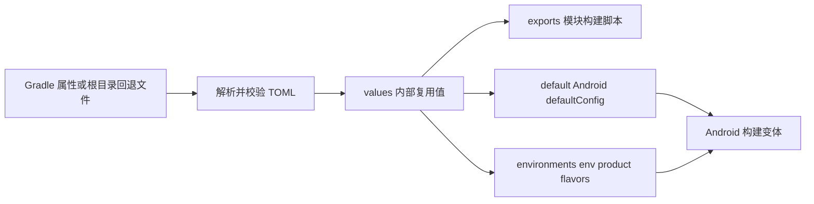

# Prism 设计文档

## 修订记录

| 修订时间（CST） | 修订人  | 修订说明                                |
|-----------------|---------|-----------------------------------------|
| 2026-08-31      | whisper | 调整 BuildConfig 辅助任务名称           |
| 2026-08-31      | whisper | 建立 Prism 设计目标, 边界和主要取舍     |

本文记录 Prism 的设计目标, 配置模型, 环境维度和主要取舍. 维护实现请阅读 [开发文档](development.md), 工程接入请阅读
[使用文档](usage.md).

## 1. 背景与目标

Android 应用通常需要在 Gradle 构建阶段维护应用标识, BuildConfig 字段, Manifest placeholder, 资源值和可选环境变体. 这些值
如果分散在多个模块构建脚本中, 容易重复, 漂移并混入具体应用的真实配置.

Prism 的目标是提供一个可选且可退出的应用构建配置入口:

* 使用一份当前选中的 TOML 作为本次构建的配置来源.
* 复用公共标量值, 同时限制模块构建脚本只能读取明确导出的值.
* 将共享字段写入 Android `defaultConfig`, 将环境差异写入独立环境维度.
* 在 Gradle 配置阶段尽早报告结构, 类型和引用错误.
* 保持 app 作为环境和应用级实现的组合根, 不让下层模块感知 app flavor 或读取 app `BuildConfig`.

## 2. 非目标

Prism 不承担以下职责:

* 管理运行时远程配置, Feature Flag 或动态环境切换.
* 解释域名, 渠道, 鉴权, 错误码或其它具体业务语义.
* 自动设置 `applicationId`, 版本, 签名和发布渠道.
* 自动开启 Android `buildConfig` 或 `resValues` 构建功能.
* 加密或安全存储密钥. TOML 仍是普通文本, 不能提交真实凭据.
* 要求所有项目或模块接入 `build-logic`.

## 3. 配置流

同一次 Gradle 构建只选择一份配置文件. 所有应用 Prism 的模块从根工程解析同一路径, 避免同一构建中的模块使用不同应用配置.
显式路径不存在时不回退, 防止因为文件名错误而悄悄使用另一套配置.

## 4. 分层配置模型

Prism 将配置分成四个职责明确的分组:

* `values` 是 TOML 内部唯一可引用的数据源, 负责消除同一标量在多个配置位置的重复.
* `exports` 是构建脚本可见边界, 允许字面量或 `values.*` 引用, 但不会隐式暴露全部 `values`.
* `default` 映射 Android `defaultConfig`, 表达所有构建变体共享的字段.
* `environments` 表达环境差异, 每个条目映射到 `env` 维度下的一个 product flavor.

引用不允许指向引用, 也不允许跨到其它分组. 这一限制牺牲了表达能力, 但避免递归, 循环引用和难以追踪的覆盖链.

## 5. `env` 维度

环境是独立于 build type 和分发渠道的变化轴, 因此 Prism 使用固定名称 `env` 建模环境维度. 只要配置存在非空
`[[environments]]`, 插件就会:

1. 在 Android DSL 中加入 `env` flavor dimension.
2. 为每个环境名称创建该维度下的 product flavor.
3. 先应用 `[default]`, 再由环境 flavor 按 AGP 原生规则覆盖同名字段.

没有环境条目时不创建 `env`, 避免单环境应用被迫增加 flavor 和变体数量. 项目已有其它 flavor dimension 时, Android 按原生规则
生成各维度的笛卡尔积; Prism 不接管其它维度, 只负责 `env`.

固定维度名称是一项公开契约. 它让各模块对环境维度保持一致, 但也意味着调用方不应把 `env` 用于渠道, 品牌或其它非环境语义.

## 6. Android DSL 边界

Prism 只写入 AGP 已有的 `defaultConfig` 和 product flavor 能力:

* `buildConfigField(...)`
* `manifestPlaceholders`
* `resValue(...)`

插件不封装 `applicationId` 等应用元数据, 因为这些值继续显式出现在 app 的 Android DSL 中更容易发现和审查. 如需复用 TOML 值,
app 可以通过 `prismAppConfig` 读取明确导出的值后自行赋值.

application 和 library 使用相同的解析与配置契约. library 只有在确实需要生成同一套构建字段时才接入 Prism; architecture, foundation
或业务模块不应为了判断当前环境而依赖该插件.

## 7. 可选性和退出能力

Prism 位于独立 included build 中, 不作为普通模块依赖传播. 未应用插件的模块不读取配置文件, 也不会增加 flavor dimension.

退出时可以把导出值和 Android 字段迁回标准 DSL, 再移除插件和 included build. 这一边界保证 Starter 可以保留 Prism 作为快速开发
能力, 同时允许实际项目选择其它配置系统.

## 8. 失败策略

配置文件属于构建输入. 文件缺失, 语法错误, 未知字段, 类型错误, 非法名称和无效引用都直接中断 Gradle 配置, 不生成部分配置.
错误信息包含实际文件路径和尽可能完整的 TOML 结构路径, 使问题在编译前暴露.

手动向 `env` 维度补充 Prism 未管理的 flavor 不会中断构建, 但会记录警告. 这是兼容已有工程的恢复路径, 不是推荐的长期配置方式.

`generatePrismBuildConfigSources` 只是开发辅助任务, 不参与配置解析和变体创建, 因此移除或不调用它不会改变正常构建行为.
