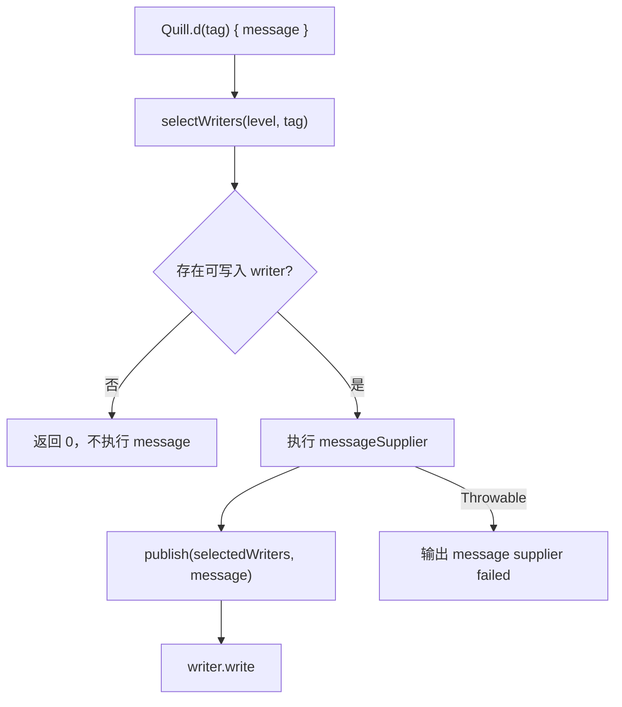

# Quill 设计文档

## 修订记录

| 修订时间（CST） | 修订人  | 修订说明                       |
|-----------------|---------|--------------------------------|
| 2026-07-28      | whisper | 新增 Quill 设计目标、模型和取舍 |

本文记录 Quill 的设计目标、核心模型和主要取舍。维护实现请阅读 [开发文档](development.md)，业务接入请阅读 [使用文档](usage.md)。

## 1. 背景与目标

传统日志调用即使最终不输出，也可能提前构建字符串：

```kotlin
Log.d(TAG, "profile=${profile.toDebugString()}")
```

Quill 的目标：

* 提供接近 Android `Log` 的调用体验。
* 使用 `() -> String` 延迟构建日志消息。
* 没有可输出 writer 时不执行消息构建函数。
* writer 可插拔，支持 Logcat、文件或远端日志扩展。
* 日志框架自身异常不影响业务流程。
* 允许业务通过不注册 writer 的方式关闭日志构建。

## 2. 非目标

Quill 不负责 crash 上报、埋点、审计日志、文件轮转、上传、压缩、加密以及业务上下文采集。此类能力应通过自定义 `QuillWriter` 实现，不放入核心模块。

## 3. 核心模型

`Quill` 是进程级日志入口，管理当前已注册的 `QuillWriter`：

```kotlin
Quill.addWriter(writer)
Quill.d(tag) { "message" }
Quill.clearWriters()
```

调用日志 API 时，Quill 先选择可处理当前级别和 tag 的 writer。只有至少一个 writer 接收该日志时，才执行消息构建函数。

`QuillLevel` 对应 Android Logcat priority：

| Quill 级别 | Android priority |
|------------|------------------|
| `VERBOSE`  | `Log.VERBOSE`    |
| `DEBUG`    | `Log.DEBUG`      |
| `INFO`     | `Log.INFO`       |
| `WARN`     | `Log.WARN`       |
| `ERROR`    | `Log.ERROR`      |
| `ASSERT`   | `Log.ASSERT`     |

Writer 契约分为两个阶段：

| 方法           | 职责                                                           |
|----------------|----------------------------------------------------------------|
| `isLoggable()` | 判断当前日志是否需要输出，也是 lazy message 的执行前置条件      |
| `write()`      | 处理已经构建好的日志，不应再因为级别或 tag 主动丢弃日志          |

## 4. 执行链路



保护边界：

* `isLoggable()` 抛出异常时，当前 writer 被视为不可写入。
* `messageSupplier()` 抛出异常时，Quill 输出失败信息并保留异常。
* `write()` 抛出异常时，不影响业务和其他 writer。
* Quill 内部 warning 失败时不会继续向业务抛出。

## 5. Logcat Writer

`LogcatQuillWriter` 同时检查最低级别和 Android `Log.isLoggable()`。消息超过 4000 字符时分段输出，`throwable` 的堆栈会追加到消息中。

`write()` 返回第一个正数打印结果；没有成功打印时返回 `0`。`VERBOSE` 和 `DEBUG` 是否输出仍取决于 Android Logcat 当前规则。

## 6. 演进原则

* 优先扩展 `QuillWriter`，不要把文件、远端和业务上下文策略放进核心入口。
* 保持 lazy message 语义，不新增会提前构建字符串的常规 message 重载。
* 修改 writer 选择语义时，同步更新设计、使用文档和测试。
* 日志框架保护边界继续捕获 `Throwable`，避免日志错误穿透业务。
